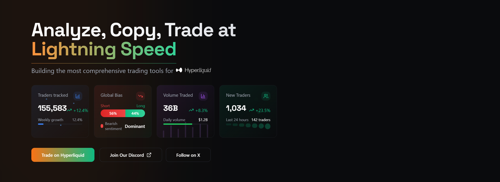

# Yoroi - The Ultimate Trading Toolkit for Hyperliquid

<!-- 
    Instructions for Discord Badge:
    1. Generate a new PERMANENT Discord invite link.
    2. Get the invite code (the part after 'discord.gg/').
    3. Replace 'YOUR_NEW_DISCORD_INVITE_CODE' below with that code. 
-->

<!-- Add other relevant badges later: Build Status, License, etc. -->

<!-- 
    Instructions for Image:
    1. Create an 'assets' folder (or similar) in your repo.
    2. Upload your banner image (e.g., 'yoroi_banner.png') to that folder.
    3. Make sure the path below matches the location and filename. 
-->

**Yoroi is building the ultimate toolkit for navigating, analyzing, and trading on the Hyperliquid DEX. Visit us at [yoroi.xyz](https://yoroi.xyz).**

---

## 👋 Welcome to Yoroi!

Welcome to the early days of Yoroi! We're incredibly excited to start building this community and platform together. Our core mission is simple: **to build the ultimate toolkit for navigating and trading on Hyperliquid.**

We know we're just starting out (a small team with a growing Discord & Twitter!), but we have a clear plan and a big vision for what Yoroi can become. We aim to provide traders with unparalleled insights, powerful execution tools, and unique opportunities within the Hyperliquid ecosystem.

## ✨ Key Features

### 🚀 What We're Building NOW (MVP - The Foundation)

Our immediate focus is on delivering core tools that provide immediate value:

*   **🔎 The Explorer:** Gain unprecedented transparency with the ability to explore ALL open positions and historical trades of every trader on Hyperliquid. Find inspiration, analyze strategies, or just see what the market is doing in real-time.
*   **👥 Simple Copy Trading:** Found a trader you like via the Explorer? We're building a straightforward way to copy their trades directly within Yoroi.
*   **💻 Integrated Terminal:** Execute your trades on Hyperliquid smoothly through the Yoroi frontend, keeping your analysis and execution seamlessly integrated in one place.

### 🔭 The Bigger Picture: Where We're Headed (Future Vision)

Beyond the initial foundation, we envision Yoroi evolving into a comprehensive trading powerhouse:

*   **🤖 Advanced Trading Tools:**
    *   **Market Making:** Integrate and fine-tune tools like Hummingbot specifically for robust market making on Hyperliquid.
    *   **Grid Bots:** Implement configurable grid trading strategies.
    *   **HFT Backend:** Provide the infrastructure necessary for users to run their own custom High-Frequency Trading (HFT) scripts.
*   **🧠 Deep AI-Powered Analytics:**
    *   Leverage advanced AI models (Transformers, Recurrent Neural Networks - RNNs, LSTMs, GRUs) to analyze the *entire* Hyperliquid blockchain history from day 0.
    *   **Goal:** Discover unique "gem" traders, uncover hidden profitable strategies, identify sophisticated market maker tactics, and understand deep market dynamics.
*   **📊 Comprehensive Market Data Aggregation:**
    *   Integrate crucial data from across the crypto landscape directly into Yoroi.
    *   **Examples:** Aggregated funding rates, open interest (OI), and Cumulative Volume Delta (CVD) from major CEXs.
    *   Incorporate insights from platforms like CryptoQuant and real-time market sentiment analysis.
*   **🚀 Flexible & Advanced Copy Trading:**
    *   Go beyond simple mirroring. Enable copy trading based on specific trader cohorts (e.g., Retail, Market Makers, HFT Algos, Whales).
    *   Implement "anti-copying" strategies, such as fading low-equity wallets (e.g., < $1000) often associated with retail sentiment.
*   **🏆 Community, Gamification & Social Trading:**
    *   Make trading more engaging and collaborative.
    *   **Features:** PvP trading battles, clan systems, public leaderboards with tangible rewards.
    *   Introduce elements potentially themed around competitive PnL or strategy success (with a slight "gambling" feel for engagement).

## 🗺️ Development Roadmap

We're building Yoroi step-by-step, focusing on delivering value iteratively.

*   **Phase 1: Foundation (Current Focus / In Progress)**
    *   ✅ **Explorer:** Deep dive into Hyperliquid positions and history.
    *   ⏳ **Simple Copy Trading:** Basic mechanism to follow selected wallets.
    *   ⏳ **Integrated Terminal:** Seamless trading execution via Yoroi frontend.
*   **Phase 2: Automation & Advanced Strategies**
    *   ◻️ **Grid Bot Implementation:** Introduce automated grid trading features.
    *   ◻️ **Market Making Integration:** Fine-tune Hummingbot (or similar) for Hyperliquid MM strategies via Yoroi.
    *   ◻️ **HFT Scripting Backend:** Develop infrastructure for users to deploy custom HFT logic.
*   **Phase 3: Intelligence Layer**
    *   ◻️ **Blockchain Data Ingestion:** Set up pipelines to process historical Hyperliquid data.
    *   ◻️ **AI Model Development & Integration:** Implement Transformers, RNNs, LSTMs, GRUs for trader/strategy analysis and discovery.
    *   ◻️ **"Gem" Finder Engine:** Launch tools based on AI analysis to identify high-potential traders and strategies.
*   **Phase 4: Expansion & Ecosystem Integration**
    *   ◻️ **Comprehensive Data Aggregation:** Integrate CEX data (Funding, OI, CVD), CryptoQuant, Sentiment feeds.
    *   ◻️ **Advanced Copy Trading Features:** Implement group-based and anti-signal copy trading.
    *   ◻️ **Social & Gamification Features:** Launch Leaderboards, PvP, Clans, and initial reward mechanisms.
*   **Phase 5: Tokenomics & Sustainability**
    *   ◻️ **Yoroi Token Launch:** Subject to stable cash flow generation and/or community governance vote. Utility tied directly to platform usage and performance metrics. (See Rewards section below).

*Legend: ✅=Completed, ⏳=In Progress, ◻️=Planned*

## 💎 Fueling Development & Rewarding Early Supporters

We believe in recognizing and rewarding those who join us early and help fuel our growth.

*   **Points System:** Earn Yoroi Points by actively using the platform. This includes:
    *   Trading on Hyperliquid using our referral link (Link to be provided when available).
    *   Utilizing features that incorporate a builder fee (when implemented).
*   **Future Utility & Token:** These points are designed to have significant future value.
    *   Our goal is to launch a **Yoroi Token** once the platform achieves stable cash flow or via a community consensus vote.
    *   The utility of this token will be intrinsically linked to platform performance, usage metrics, and potentially governance. Examples include unlocking premium features, receiving fee discounts, staking rewards, or participating in governance decisions.
    *   **Your early activity directly contributes to earning these points and potential future token allocation.**

## 🤝 Join Us on This Journey!

This is just the beginning. Yoroi is being built *with* the community, *for* the community. Your feedback, ideas, and participation are invaluable, especially in these formative stages.

*   ❓ **Ask questions:** Don't hesitate to ask anything in our [Discord](https://discord.gg/34FDz4sWRP).
*   💡 **Share your ideas:** What features would you love to see?
*   🗣️ **Provide feedback:** Tell us what you think of the Explorer and upcoming tools.
*   📈 **Use the platform:** Once live, actively use Yoroi and share your experience. Visit [yoroi.xyz](https://yoroi.xyz) for updates.
*   🐦 **Follow us:** Stay updated via our [Twitter](https://x.com/YoroiXYZ).

**Let's build the future of Hyperliquid trading together! We're thrilled to have you here.**

## 📄 License

This project is licensed under the MIT License - see the [LICENSE](LICENSE) file for details.
